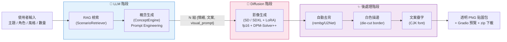

# 🎨 隨手貼 StickerForge — 個人化 AI 貼圖生成系統

> 深度生成模型 期末專題 ｜ 結合 **LLM (概念發想)** 與 **Diffusion (影像生成)** 的端到端生成式 AI 應用

輸入一句主題情境(例如「一隻慵懶橘貓的日常心情」),系統就會自動產出 **一整組風格一致、情緒各異** 的貼圖 —— 由大型語言模型發想文案與繪圖概念,擴散模型負責作畫,再經自動去背、白色描邊、文案疊字,輸出可直接使用的透明 PNG 貼圖包。

---

## 專題亮點與技術對應

本專題同時涵蓋作業要求的 **兩大技術領域**,對應如下:

| 作業技術要求 | 本專題的實作 | 對應檔案 |
|---|---|---|
| **LLM — Prompt Engineering** | 精心設計的 system prompt + few-shot,強制角色一致、情緒多樣、貼圖構圖、嚴格 JSON 輸出 | `src/llm/concept_engine.py` |
| **LLM — RAG 架構** | 以中文嵌入模型檢索「常見貼圖情境語料庫」,作為概念發想的 grounding context | `src/llm/rag.py` + `data/sticker_scenarios.json` |
| **LLM — API / 本機推論** | 統一 OpenAI 相容客戶端,可無縫切換 OpenRouter / Ollama / Big Pickle | `src/llm/client.py` |
| **Diffusion — LoRA 權重掛載** | `load_lora_weights` + `fuse_lora` 套用貼圖風格 | `src/diffusion/pipeline.py` |
| **Diffusion — Pipeline 客製化** | 切換 scheduler、關閉 safety checker、後處理鏈整合 | `src/diffusion/pipeline.py`、`src/postprocess/` |
| **Diffusion — 推論加速** | fp16 半精度 + DPM-Solver++ 排程器 + attention slicing + (選用) xformers | `src/diffusion/pipeline.py` |

> 額外工程亮點:**自動去背 (rembg/U2Net)**、**LINE 風格模切白邊**、**CJK 文案疊字**,以及完整的 **graceful degradation** —— 缺少 GPU / sentence-transformers / rembg / 字型時皆自動降級,系統永遠跑得起來。

---

## 系統架構



**資料流 (前後端介接格式):**
LLM 階段輸出統一為結構化 JSON 陣列,每個元素為
`{ "emotion": 情緒, "caption": 文案, "scene": 場景, "visual_prompt": 英文提示詞, "negative_prompt": 負面提示詞 }`,
作為擴散階段的輸入契約;後處理逐張接手,最終由 `StickerForge.pack()` 打包成 zip 供 Gradio 下載。

---

## 專案結構

```
stickerforge/
├── app.py                      # Gradio 互動式 App (入口)
├── config.py                   # 中央設定 (環境變數覆寫)
├── requirements.txt            # 依賴清單
├── environment.yml             # conda 環境檔
├── .env.example                # 環境變數範例 (含三種 LLM 後端)
├── data/
│   └── sticker_scenarios.json  # RAG 語料庫:常見貼圖情境
├── src/
│   ├── forge.py                # 主流程協調器 (串接四階段)
│   ├── llm/
│   │   ├── client.py           # 可插拔 LLM 客戶端
│   │   ├── rag.py              # RAG 檢索 (語意 + 關鍵字降級)
│   │   └── concept_engine.py   # 概念生成 (Prompt Engineering 核心)
│   ├── diffusion/
│   │   ├── pipeline.py         # 擴散生成 (真實 SD/SDXL + 佔位生成器)
│   │   └── styles.py           # 風格 preset
│   ├── postprocess/
│   │   ├── background.py       # 自動去背 + 描邊
│   │   └── caption.py          # 文案疊字 (CJK 字型偵測)
│   └── utils/
│       └── logging.py
├── scripts/
│   ├── check_setup.py          # 環境自我檢查
│   └── smoke_test.py           # 端到端煙霧測試 (免 GPU / API key)
└── assets/
    ├── fonts/                  # (選用) 自帶 CJK 字型
    └── outputs/                # 生成結果輸出
```

---

## 在本地端執行

### 1. 取得程式碼與建立環境

```bash
git clone <你的-repo-url> stickerforge
cd stickerforge

# 建議使用虛擬環境
python -m venv .venv
source .venv/bin/activate        # Windows: .venv\Scripts\activate
```

### 2. 安裝依賴

**最小安裝(只跑 LLM + 佔位生成器,無需 GPU)：**
```bash
pip install openai gradio Pillow numpy python-dotenv sentence-transformers
```

**完整安裝(含真實影像生成,需 NVIDIA GPU)：**
```bash
# 先依你的 CUDA 版本安裝 torch (範例為 CUDA 12.1)
pip install torch --index-url https://download.pytorch.org/whl/cu121
# 再安裝其餘依賴
pip install -r requirements.txt
```

> 中文文案疊字需要 CJK 字型。Linux 可執行 `sudo apt install fonts-noto-cjk`;
> 或把任意 `.ttf/.otf` 放到 `assets/fonts/`;或在 `.env` 設定 `FONT_PATH`。

### 3. 設定環境變數

```bash
cp .env.example .env
```

打開 `.env`,**至少填入一組 LLM 後端**(三選一):

- **OpenRouter**(最方便):填 `LLM_API_KEY`,`LLM_MODEL=anthropic/claude-3.5-sonnet`
- **Ollama**(離線免費):先 `ollama pull qwen2.5:7b`,設 `LLM_BASE_URL=http://localhost:11434/v1`、`LLM_MODEL=qwen2.5:7b`
- **Big Pickle / OpenCode**:依課程提供的 endpoint 與金鑰填入,`LLM_MODEL=opencode/big-pickle`

若要啟用真實影像生成,於 `.env` 設定 `LORA_PATH`(貼圖風格 LoRA,見下方)並確認 `DIFFUSION_ENABLED=true`。

### 4. 檢查環境(選用但建議)

```bash
python scripts/check_setup.py
```
會逐項列出各元件是否就緒,並測試 LLM 連線。

### 5. 啟動 App

```bash
python app.py
```
瀏覽器開啟 **http://127.0.0.1:7860** ,輸入主題即可生成。

### 6. 不啟動 App 也想驗證流程?

```bash
python scripts/smoke_test.py
```
此測試用假的 LLM 回應 + 佔位生成器跑完整條管線,**完全不需 GPU 或 API key**,輸出會存到 `assets/outputs/`。

---

## 取得貼圖風格 LoRA

本系統的影像品質取決於所掛載的 LoRA。建議到 [Civitai](https://civitai.com) 或 [HuggingFace](https://huggingface.co) 搜尋關鍵字如 `sticker`、`chibi`、`flat illustration`、`LINE sticker` 等風格 LoRA,下載 `.safetensors` 後:

```bash
# .env 設定本機路徑
LORA_PATH=/path/to/your/sticker_style.safetensors
LORA_SCALE=0.85
```

或直接填 HuggingFace repo id。未設定 `LORA_PATH` 時會使用基礎模型(仍可運作,只是較不貼圖風)。

---

## 使用說明

1. **主題 / 情境**(必填):描述你想要的貼圖主軸。
2. **角色設定**(選填):指定角色外觀以維持整組一致;留空則由 AI 設計並自動保持一致。
3. **風格**:可愛卡通 / Q版大頭 / 手繪塗鴉 / 線條簡約 / 像素風 / 水彩手帳 / 3D 軟糖。
4. **進階設定**:亂數種子、固定角色、自動去背、白色描邊、疊上文案皆可切換。
5. 按 **開始生成**,右側會顯示貼圖預覽、LLM 概念明細表,以及可下載的 zip 貼圖包。

---

## 疑難排解

| 問題 | 原因與解法 |
|---|---|
| 狀態列「影像生成:佔位生成器」 | 未偵測到 GPU 或未裝 `torch`/`diffusers`。安裝後重啟即切換為真實作畫 |
| 狀態列「RAG:關鍵字檢索」 | 未安裝 `sentence-transformers`,屬正常降級;安裝即啟用語意檢索 |
| LLM 連線失敗 | 檢查 `.env` 的 `LLM_API_KEY` / `LLM_BASE_URL` / `LLM_MODEL`;Ollama 需先啟動服務 |
| 貼圖沒有中文字 | 缺 CJK 字型。`sudo apt install fonts-noto-cjk` 或設定 `FONT_PATH` |
| 去背沒生效 | 未安裝 `rembg`;`pip install rembg`(首次執行會下載 U2Net 模型) |
| CUDA out of memory | 調低 `IMAGE_SIZE`(如 512)、`NUM_INFERENCE_STEPS`,或改用 SD1.5(`USE_SDXL=false`) |
| 角色每張長不一樣 | 開啟「固定角色」、填寫明確的「角色設定」;進一步可訓練角色 LoRA 或用 IP-Adapter |

---

## 工具

- 影像生成:[🤗 Diffusers](https://github.com/huggingface/diffusers)、Stable Diffusion
- 去背:[rembg](https://github.com/danielgatis/rembg)(U2Net)
- 嵌入:[BAAI/bge-small-zh](https://huggingface.co/BAAI/bge-small-zh-v1.5)
- 介面:[Gradio](https://www.gradio.app/)

